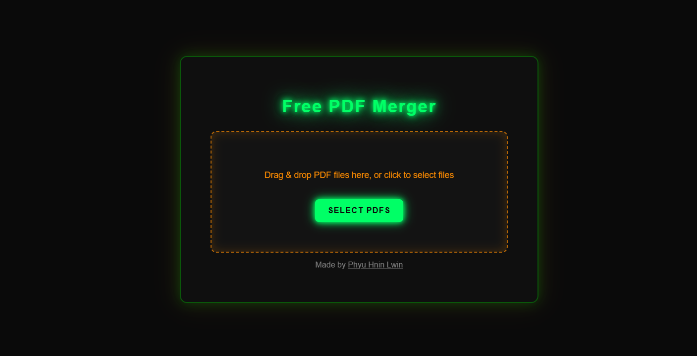

# Free PDF Merger

Merge multiple PDF files quickly and securely without uploading to any server.

  

## How It Works

### Technology Stack
- **Frontend**: HTML5, CSS3, Vanilla JavaScript
- **PDF Processing**: [PDF-lib](https://pdf-lib.js.org/) v1.17.1
- **Styling**: Custom CSS with neon/cyberpunk theme
- **CDN**: jsDelivr for PDF-lib delivery

## Author

**Phyu Hnin Lwin**
- GitHub: [@phyulwin](https://github.com/phyulwin)

## Acknowledgments

- [PDF-lib](https://pdf-lib.js.org/) - Excellent PDF manipulation library
- [jsDelivr](https://www.jsdelivr.com/) - Fast and reliable CDN
- Cyberpunk aesthetic inspiration

---

**Made with ❤️ by [Phyu Hnin Lwin](https://github.com/phyulwin)**
